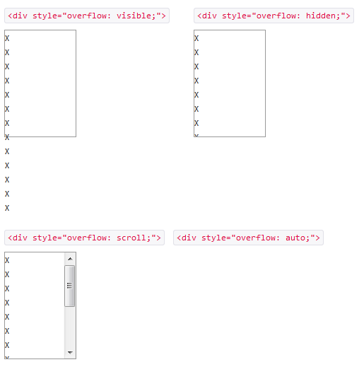

# jquery.flickable.js の紹介

## 概要
 * jqueryプラグイン
 * マウスのフリック操作でスマフォみたいにスクロールできるようになる
 * スマフォでも使える
 * __Android2.xにおける、`overflow:auto`が効かないバグにも対応可能__
 
 
## DEMO
 [DEMO](http://lagoscript.org/jquery/flickable/demo)
 
 
## スクロールしたいとき

 →　ブロック要素に`overflow: scroll;` `overflow: auto;` などのスタイルを適用  
 &nbsp;
 

 [サンプルoverflow](http://test.flak.jp/amasaki/sample_overflow.html)
 
### Android2.xでは全て`overflow: hidden;` になってしまう！
 
 →　自前のjsで実装しましょう。
 
 →　jquery.flickable.js のような便利なプラグインがあるよ。
 
 
## 個人的に困ったこと

 * スクロールする要素に設定したタッチイベントが起動しなくなった。
 
 →　jquery.flickable.js内で`event.preventDefault();`で後続の処理がキャンセルされていたため。
 →　今回は単純にコメントアウトで対応。
 
 
## 参考URL
 * [配布元](http://lagoscript.org/jquery/flickable)
 * [jQuery.flickableがうまく動かないときの対処法](http://utatane.littlestar.jp/tut/archives/68)
 