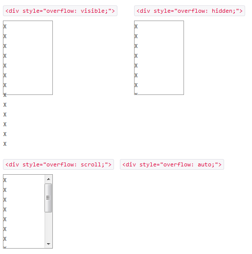

# jquery.flickable.js の紹介

## 概要
 * マウスのフリック操作でスマホみたいにスクロールできるようになるjqueryプラグイン
 * スマホやIE6でも使える
 * __Android2.xにおける、`overflow:auto`が効かないバグにも対応可能__
 
 
## DEMO
 [配布元DEMO](http://lagoscript.org/jquery/flickable/demo)
 
 
## Android2.xの overflow バグ
 
### スクロールしたいとき

 →　ブロック要素に`overflow: scroll;` `overflow: auto;` などのスタイルを適用
 

 [サンプルoverflow](http://test.flak.jp/amasaki/sample_overflow.html)
 
### Android2.xでは全て`overflow: hidden;` になってしまう！
 
 →　自前のjsで実装しましょう。
 
 →　jquery.flickable.js のような便利なプラグインがあるよ。
 
 
## 注意点
 jQuery1.6以上に対応していない
 
  →　下記「参考URL」から対応版DL
 
## 個人的に困ったこと

 * スクロールする要素に設定したタッチイベントが起動しなくなった。
 * スクロールする要素内に張ったリンクが上手く機能しない場合がある。
 
 →　jquery.flickable.js内で`event.preventDefault();`で後続の処理がキャンセルされていたため。
 
 　→　今回は単純にコメントアウト（433 463行目）で対応
 
 
## 参考URL
 * [配布元](http://lagoscript.org/jquery/flickable)
 * [jQuery.flickableがうまく動かないときの対処法](http://utatane.littlestar.jp/tut/archives/68)
 