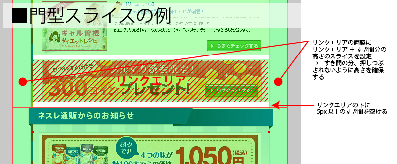
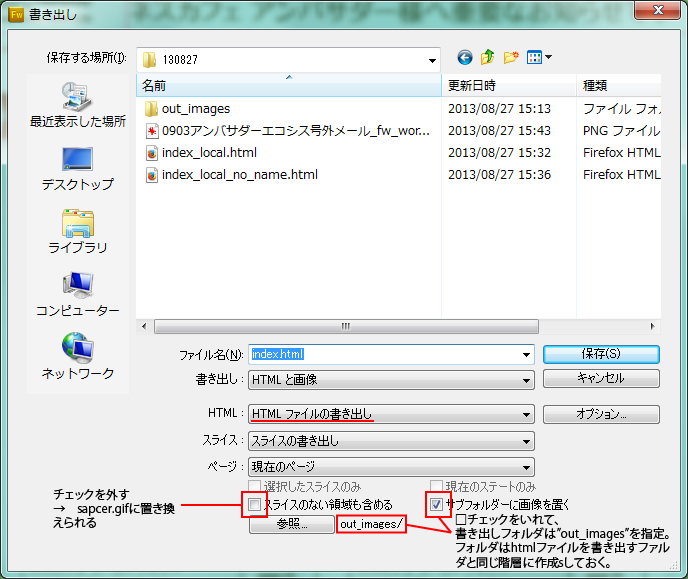


# ネスレメルマガ　コーディング方法まとめ

## 概要

### 作業の流れ

 1. 依頼ファイルセットの受取
 2. Fireworksでスライス　→　書き出し
 3. 書きだしたHTMLの修正
 4. レギュレーションチェック
 5. 配信テスト
 6. 納品ファイルセットの準備
 

### 注意点
* 画像のALTはレギュレーションに沿って設定する
* Hotmailで受信した場合、リンク画像の下に勝手にマージが設定されてしまうのでコーディングで工夫する。

 ※Outlookで配信してHotmailで受信した場合のみ発生

## データの受取
 *リンクリスト.txt
 *jpg
 *png（Fireworks編集ファイル）

## スライス
※以下は、Fireworksを使用した例です。

### 画像リンクは門型スライスで
リンクがつくところの画像は下に5px以上の隙間ができるようにスライスする。
 > hotmailで受信した時に、画像リンク下部に謎のマージンがつくため

※デザインの時点で、リンク画像の下部にはベタ背景のみを引くように注意する。  
※テキストリンクの場合は問題ない。  
（文字、画像、グラデーションが重ならないデザインにすること。）

### リンクとALTの設定
 * リンク画像には指定のURLとALTを設定する。  
 * targetは全て”_blank”に設定する。

### 画像の最適化
 「最適化」パネルでjpgの圧縮率を設定する。  
 （書き出し画像の合計サイズが 1MB以下 で最大になるように調整）

## HTML/画像書き出し
スライスができたら、書き出し（Alt + Ctrl + R）する。  
設定のポイントは

 * ファイル名　→　”index.html”指定
 * HTML　→　HTMLファイルの書き出し
 * スライスのない領域も含める　→　チェックを外す
 * サブフォルダーに画像を置く　→　チェックを入れる
 * サブフォルダ　→　”out_images”指定（書き出すHTMLと同じ階層に作成しておく）
 

## HTML修正
※以下はDreamweaverを使用した例です。

 * 文字コードを「S-JIS」に設定  
  修正　→　ページプロパティ（Ctrl + J）　→　タイトル/エンコーディング  
  エンコーディング（E）で”日本語(シフト JIS)”を選択
  
 * ＜titile＞設定  
  （例）ネスレアミューズからのお知らせ August
  
 * 基本＜style＞の追加  
 ``
 
 * 「 画像が上手く表示されない方は～」リンク設定  
  （例）＜table＞タグ直下に行を追加  
  `<tr bgcolor="#ffffff">  
   <td height="22" style="font-size:10pt; line-height:1; text-align:center;">  
     <a class="fc_1" href="http://magazine.nestle.co.jp/shop/130828bddm/index_webup.html" target="_blank" style="font-size:10pt; line-height:1.4 !important;">  
       ※画像が上手く表示されない方は、こちらをクリックしてください。  
     </a>  
   </td>  
  </tr>`
  
 * ＜table＞タグのインラインスタイルの変更  
  "display: inline-table;"　→　"display: block !important;"
  
 * ページ全体の中央寄せ  
  左右マージンを”auto”に
  
 * 画像リンク下のすき間画像削除  
  書き出しの際に、「スライスのない領域も含める」のチェックを外していれば  
  画像リンク直下のスライスを設定しなかった箇所が「spager.gif」に自動で置き換わっているので  
  それを目印に「spacer.gif」を含む＜td＞タグごと削除する。  
  （空の＜tr＞タグだけが残る状態）
  
 * amp;の削除  
  URL中に「&」が入っている場合、Fireworksで書きだした際に`「&amp;」`に自動変換されるが、  
  メルマガ配信時に文字化けするため、`「&amp;」`→「&」に変更しておく。

## レギュレーションチェック
 別添資料の「YYMMDDddm_チェックリスト.xls」を参考にALTテキストのレギュレーションをチェックする。

## 配信テスト
 outlookを使ってテスト用のアドレスに配信し、Webメール等で表示にくずれがないかチェックする。  
 ※2031年2月ごろ、Outlook.comの開始に伴いHotmailの仕様が変更されたため  
 正確に表示の確認ができなくなったが、今まで通りのコーディング方法で問題ないとのこと。  
 Thunderbirdなどの他のメーラでの受信チェックのみ行っています。

## 納品ファイルセット
 作成するファイルは3種類
 
 * index_local.html　→　制作者確認用
 * index.html　→　配信用
 * index_webup.html　→　WEBサイト掲載用（「画像がうまく表示されない方は～」リンクから飛んでくる）

### index_local.html
 Fireworksから書き出して、上記修正を施したもの。  
 画像パスは相対パスで記述されている。

### index.html
 index_local.htmlをメール配信用に修正したもの。  
 画像パスは絶対パスで記述。  
 パスは毎回変更になりますが、慣例として  
  （例） src="http://magazine.nestle.co.jp/shop/130828ddm/out_images/index_r1_c1.jpg"  
  上記の”/130828ddm/”の数字の部分が配信日になってます。
  
 **ABテストがある場合**  
 ABテスト（後述）がある場合は  
 （例）  
 【Aファイル】 src="http://magazine.nestle.co.jp/shop/130828addm/out_images/index_r1_c1.jpg"  
 【Bファイル】 src="http://magazine.nestle.co.jp/shop/130828bddm/out_images/index_r1_c1.jpg"  
 配信日と”ddm”の間に”a”又は”b”が入ります。

### index_webup.html
 index.htmlから「見えない方はこちら～」リンクを削除したもの。

 **差し込みデータ（顧客名等）がある場合**  
 顧客名や所持ポイントなどの差し込みデータがあるメールの場合、  
 「#%%MSG02%%#」のような置換文字列を記述します。  
 これは、全てのお客さまが閲覧するindex_webup.htmlの場合不要となるので削除します。  
 （削除したことにより前後の画像がずれるので、高さの調整なども必要です）

### 納品ディレクトリ構成
「sample/メルマガ格納ディレクトリ/」フォルダ参照

以上