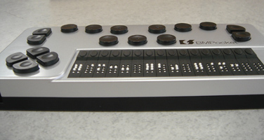

# Webアクセシビリティ

## 1.概要
 - アクセシビリティ
 
 さまざまな製品や建物やサービスなどが、年齢・身体的制約・利用環境等に関係なく、支障なく利用できるかどうか。あるいはその度合。
 
 - JIS X 8341-3:2010  
 
 日本でも2004年に「高齢者・障害者等配慮設計指針－情報通信における機器，ソフトウェア及びサービス－第3部：ウェブコンテンツ」（JIS X 8341-3:2004）としてJIS化。

## 2.Webアクセシビリティ

 - 視覚障害の方などが使用する音声読み上げソフト、点字ディスプレイなどに対応したレイアウトや記述がなされているか。
 - 弱視や老眼の方が用意にフォントサイズや配色を変更できるか。
 - 手の障害のためにマウスの操作がうまくできない場合、キーボードで操作することが可能か。

---

## 3.よくある事例

### 画像のalt属性を設定しよう

 -  __タイトル画像__ などはCSSではなく、``要素を用いて、 __alt属性__ に代替テキストを記述する
 
 →　CSSスプライトや、画像置換等のテクニッと相反する要求。
 
 - 見た目が同じであってもリンク先が異なるのであれば、それがわかるように代替テキストに 言葉を補足する
 
 →　[（例）『PDFダウンロード』　→　『「インストールマニュアル」のPDFダウンロード』](http://www.soumu.go.jp/ict-media/worksheet/)
 
 -  装飾画像 は、 __alt属性を空（alt=””）__ にするか、あるいはCSSを用いる 
 
alt属性は必ず設定し、内容が理解できるに適切なテキストを入力する。  
設定すべきテキストがない場合でも空（alt=""）を設定する。

### 文書構造を明確にしよう
 - `<h1>～<h6>`要素を用いた見出しのマークアップ。
 
 →　読み上げソフトは見出しタグを読み上げの対象とします。
 
 - `<ul>`要素を用いたマークアップ。

ソースコードでも文書構造が解釈できるように、マシンリーダブルにマークアップすることがアクセシビリティ確保の基本である。 

### スキップリンクの設置
メニュー項目を飛ばして、本文から読み始められるようにする【ナビゲーションスキップ】として設定されることが多い。  
ただし、スキップリンクについては、ウェブアクセシビリティ基盤委員会がメインコンテンツの開始位置に見出しのマークアップがあれば不要ではないかという見解を出し、2013年1月7日よりパブリックコメントを募集するところである。実装するかどうかは、その結論を待ってから判断したほうがよい。 

（参考URL）

 * [富士通](http://pr.fujitsu.com/jp/news/2011/07/8.html)
 * [JIS X 8341-3:2010 達成基準7.2.4.1を満たす条件に関する意見募集の結果について](http://www.waic.jp/news/20130422.html)

### 適切なページタイトル
ページタイトルは、そのウェブページの内容がわかるように記述しなければならない。  
また、サイト名を併記することが推奨されている。  
 →　[下層ページのタイトル表記注意](http://www.soumu.go.jp/ict-media/internet/01.html)

### 複数の到達手段の準備
ユーザーが目的のウェブページに到達できる複数の手段を提供するために、以下のいずれかを追加する必要がある。

 * サイトマップ
 * サイト内検索
 * HOMEページ（トップページ）上に全ページへのリンク 

### Flashコンテンツのアクセシビリティ確保
 * キーボードだけで操作できるようにする
 
 [Flashのアクセシビリティについて考える 第2回　キー操作に対応する](http://gihyo.jp/design/serial/01/flash_accessibility/0002)
 
 →　 __【キーボードトラップ】__ の問題　→　SWFFocusクラスの使用  
 
  - [FLASH17： Flash オブジェクトをキーボードで操作可能にして、キーボードトラップを回避する](http://waic.jp/docs/WCAG-TECHS/FLASH17.html)  
  - [swfFocusサンプル](http://test.flak.jp/amasaki/swffocus/)
 
 →　課題：ChromeとSafariのWindows版は非対応。JavaScriptを有効にする必要がある。
 
 * 自動的に再生しないようにするか、ページの先頭付近に一時停止ボタンを提供しなければならない。
 * ボタンに代替テキストを提供する
 
 [Flashのアクセシビリティについて考える 第3回　読み上げに配慮する](http://gihyo.jp/design/serial/01/flash_accessibility/0003)

また、Flashを「依存するウェブコンテンツ技術」としない場合には、Flashが提供しているのと同じリンクをHTMLベースで提供しなければならない。  
今後、iPhoneやiPadでの利用も考慮するならば、Flashではなく、JavaScriptを用いた実装に切り替えることも検討する必要がある。  

（参考URL）

 * [H53: object要素のボディに代替テキストを記述する](http://waic.jp/docs/WCAG-TECHS/H53.html)
 * [FLASH1： 非テキストオブジェクトに名前プロパティを設定する](http://waic.jp/docs/WCAG-TECHS/FLASH1.html)
 
### 動画の代替コンテンツ 
 主に動画を見ることのできないユーザーのために、動画で提供している情報をテキストに書き起こした代替コンテンツを提供する必要がある。

---
## 4.今後のWEBアクセシビリティ

 - HTML5におけるWEBアクセシビリティ
  * 「セマンティック（構造の意味付け）」「WAI-ARIA（役割／状態）」という仕様から、よりアクセシブルになるのでは。  
  * ただし、ブラウザや支援技術側の対応が必要。

## 5.参考URL
 - W3C
  * [WCAG 2.0 実装方法集](http://waic.jp/docs/WCAG-TECHS/Overview.html#contents)
 - 技術解説
  * [Webアクセシビリティを理解し実践するためのポータルサイト、インフォアクシア](http://www.infoaxia.com/)
  * [Flashのアクセシビリティについて考える（gihyo.jp）](http://gihyo.jp/design/serial/01/flash_accessibility)
  * [WAI-ARIAによるアクセシブルRIA（ThinkIT）](http://thinkit.co.jp/book/2008/08/27/161)
  * [アクセシビリティを加速するWAI-ARIA](http://www.slideshare.net/mlca11y/waiaria)
  * [アクセシビリティに配慮したFlashコンテンツ（富士通）](http://jp.fujitsu.com/accessibility/casestudy/pdpflash/)
 - 見本サイト
  * [富士通](http://pr.fujitsu.com/jp/news/2011/07/8.html)
  * [伸ばそう ICTメディアリテラシー - 総務省](http://www.soumu.go.jp/ict-media/)
  * [【旧版】伸ばそう ICTメディアリテラシー - 総務省](http://test.flak.jp/amasaki/ict_old/)
 - 読み上げツール
  * [ACTF aDesigner](http://www.eclipse.org/actf/downloads/tools/aDesigner/index.php)
