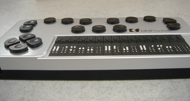

# WEBアクセシビリティ

## 1.概要
 - アクセシビリティ  
 さまざまな製品や建物やサービスなどが、年齢・身体的制約・利用環境等に関係なく、支障なく利用できるかどうか。あるいはその度合。  
 
 
 - JIS X 8341-3:2010  
 日本でも2004年に「高齢者・障害者等配慮設計指針－情報通信における機器，ソフトウェア及びサービス－第3部：ウェブコンテンツ」（JIS X 8341-3:2004）としてJIS化。

## 2.例えば（WEBの場合）
 - 視覚障害の方などが使用する音声読み上げソフト、点字ディスプレイなどに対応したレイアウトや記述がなされているか。
 - 弱視や老眼の方が用意にフォントサイズや配色を変更できるか。
 - 手の障害のためにマウスの操作がうまくできない場合、キーボードで操作することが可能か。

---

## 3.よくある事例

### 画像のalt属性と代替テキスト（達成基準7.1.1.1、達成基準7.2.4.4）
画像を用いる際には、次の三点に留意して、代替テキストを提供するとよい。  
 -  __タイトル画像__ などは情報を伝えているので、CSSではなく、``要素を用いて、 __alt属性__ に代替テキストを記述する  
 →　CSSスプライトや、画像置換等のテクニッと相反する要求。
 - リンク画像の __代替テキスト__ が同一の文言となる場合は、リンク先が異なるのであれば、それがわかるように代替テキストに __言葉を補足する__  
 →　[（例）『PDFダウンロード』　→　『「インストールマニュアル」のPDFダウンロード』](http://www.soumu.go.jp/ict-media/worksheet/)
 -  __装飾画像__ もalt属性を省略することはできないため、 __alt属性を空（alt=””）__ にするか、あるいはCSSを用いる 

### 文書構造のマークアップ（達成基準7.1.3.1）
 - `<h1>～<h6>`要素を用いた見出しのマークアップ。  
 →　読み上げソフトは見出しタグを読み上げの対象とします。
 - `<ul>`要素を用いたマークアップ。

ソースコードでも文書構造が解釈できるように、マシンリーダブルにマークアップすることがアクセシビリティ確保の基本である。 

### スキップリンク（達成基準7.2.4.1） 
メニュー項目を飛ばして、本文から読み始められるようにする【ナビゲーションスキップ】として設定されることが多い。  
ただし、スキップリンクについては、ウェブアクセシビリティ基盤委員会がメインコンテンツの開始位置に見出しのマークアップがあれば不要ではないかという見解を出し、2013年1月7日よりパブリックコメントを募集するところである。実装するかどうかは、その結論を待ってから判断したほうがよい。 

（参考URL）
 * [富士通](http://pr.fujitsu.com/jp/news/2011/07/8.html)
 * [JIS X 8341-3:2010 達成基準7.2.4.1を満たす条件に関する意見募集の結果について](http://www.waic.jp/news/20130422.html)

### ページタイトル（達成基準7.2.4.2） 
ページタイトルは、そのウェブページの内容がわかるように記述しなければならない。  
また、サイト名を併記することが推奨されている。  
 →　[下層ページのタイトル表記注意](http://www.soumu.go.jp/ict-media/internet/01.html)

### 複数の到達手段（達成基準7.2.4.5） 
ユーザーが目的のウェブページに到達できる複数の手段を提供するために、以下のいずれかを追加する必要がある。
 * サイトマップ
 * サイト内検索
 * HOMEページ（トップページ）上に全ページへのリンク 

### Flashコンテンツのアクセシビリティ確保 
トップページで使用しているFlashについては、以下のような改善点がある。  
 * キーボードだけで操作できるようにする  
 [Flashのアクセシビリティについて考える 第2回　キー操作に対応する](http://gihyo.jp/design/serial/01/flash_accessibility/0002)
 
 →　【キーボードトラップ】の問題　→　SWFFocusクラスの使用  
 [FLASH17： Flash オブジェクトをキーボードで操作可能にして、キーボードトラップを回避する](http://waic.jp/docs/WCAG-TECHS/FLASH17.html)  
 →　課題：ChromeとSafariのWindows版は非対応。JavaScriptを有効にする必要がある。
 
 * 必要に応じて、ユーザーが一時停止できるようにする 
 * ボタンに代替テキストを提供する 
 [Flashのアクセシビリティについて考える 第3回　読み上げに配慮する](http://gihyo.jp/design/serial/01/flash_accessibility/0003)

また、Flashを「依存するウェブコンテンツ技術」としない場合には、Flashが提供しているのと同じリンクをHTMLベースで提供しなければならない。  
今後、iPhoneやiPadでの利用も考慮するならば、Flashではなく、JavaScriptを用いた実装に切り替えることも検討する必要がある。  

### 動画コンテンツ 
 * 主に動画を見ることのできないユーザーのために、動画で提供している情報をテキストに書き起こした代替コンテンツを提供する必要がある。
 * 自動的に再生しないようにするか、ページの先頭付近に一時停止ボタンを提供しなければならない。

（参考URL）
 * [H53: object要素のボディに代替テキストを記述する](http://waic.jp/docs/WCAG-TECHS/H53.html)
 * [FLASH1： 非テキストオブジェクトに名前プロパティを設定する](http://waic.jp/docs/WCAG-TECHS/FLASH1.html)

---
## 4.参考URL
 - W3C
  * [WCAG 2.0 実装方法集](http://waic.jp/docs/WCAG-TECHS/Overview.html#contents)
 - 技術解説
  * [Webアクセシビリティを理解し実践するためのポータルサイト、インフォアクシア](http://www.infoaxia.com/)
  * [Flashのアクセシビリティについて考える（gihyo.jp）](http://gihyo.jp/design/serial/01/flash_accessibility)
  * [アクセシビリティに配慮したFlashコンテンツ（富士通）](http://jp.fujitsu.com/accessibility/casestudy/pdpflash/)
 - webアクセシビリティに対応したサイト
  * [伸ばそう ICTメディアリテラシー - 総務省](http://www.soumu.go.jp/ict-media/)
 - スキップリンクの見本
  * [富士通](http://pr.fujitsu.com/jp/news/2011/07/8.html)
 - 読み上げツール
  * [ACTF aDesigner](http://www.eclipse.org/actf/downloads/tools/aDesigner/index.php)
 - アクセシビリティチェック
  * [HAREL(ハレル)](http://harel.nttdata.co.jp/wact/inputProc/inputUrlBL.do)
